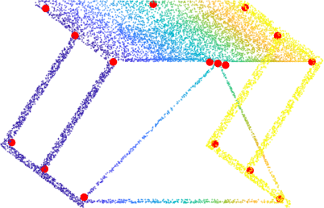
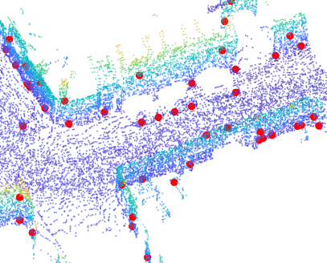
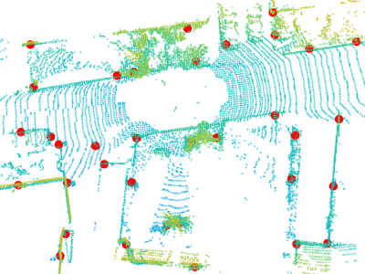

# USIP
[**USIP: Unsupervised Stable Interest Point Detection from 3D Point Clouds.**](https://arxiv.org/abs/1904.00229) ICCV 2019, 
Seoul, Korea <br/>
[Jiaxin Li](https://www.jiaxinli.me/), [Gim Hee Lee](https://sites.google.com/site/gimheelee/) <br/>
Department of Computer Science, National University of Singapore

```
@article{li2019usip,
  title={USIP: Unsupervised Stable Interest Point Detection from 3D Point Clouds},
  author={Li, Jiaxin and Lee, Gim Hee},
  journal={arXiv preprint arXiv:1904.00229},
  year={2019}(
}
```

## Introduction
USIP detector: an Unsupervised Stable Interest Point detector that can detect highly repeatable and accurately localized keypoints from 3D point clouds under arbitrary transformations without the need for any ground truth training data.

Examples of keypoints detected by our USIP are shown below for ModelNet40, Redwood, Oxford RobotCar, KITTI, respectively.






This repository consists of point cloud keypoint detector / descriptor for Oxford RobotCar, KITTI, SceneNN, ModelNet40, 3DMatch.

## Installation
Rquirements:
- Python 3
- [PyTorch 1.1 or higher](http://pytorch.org/)
- [visdom](https://github.com/facebookresearch/visdom)
- Compile customized cuda module - index_max:
```
cd models/index_max_ext
python3 setup.py install
```
- Compile customized cuda module - ball_query:
```
cd models/ball_query_ext
python3 setup.py install
```
- Python wrapper over PCL point cloud keypoint detectors: ISS, Harris3D, SIFT3D: https://github.com/lijx10/PCLKeypoints
```
python3 setup.py install
```


## Dataset
[This Google Drive link](https://drive.google.com/open?id=1e3m4jZxtJmBbtPoL2nIYVGPN9G4-p8fg) contains datasets used in our paper: KITTI, Oxford RobotCar, 3DMatch, ModelNet40, Redwood, SceneNN.

## Trained Models
[This Google Drive link](https://drive.google.com/open?id=1aUX5yEsTjwZmBzEOGdKUgq80NQQNJ3d9) contains our trained models for some datasets.

## Usage
Each folder of `kitti`, `match3d`, `modelnet`, `oxford`, `scenenn` contains configuration script `ooptions_***` and training scripts `train_***`. Please modify the configurations files before running the training scripts. For example, you may have to modify the default value of `--dataset`, `--dataroot`, `--gpu_ids`.

## Evaluation
1. Save detected keypoints via ``evaluation/save_keypoints.py``
2. Run Matlab based evaluation code via ``evaluation/matlab``

### Visualization
We use visdom for visualization. Various loss values and the reconstructed point clouds (in auto-encoder) are plotted in real-time. Please start the visdom server before training, otherwise there will be warnings/errors, though the warnings/errors won't affect the training process.
```
python3 -m visdom.server
```
The visualization results can be viewed in browser with the address of:
```
http://localhost:8097
```

## License
This repository is released under GPL-3.0 License (see LICENSE file for details).
